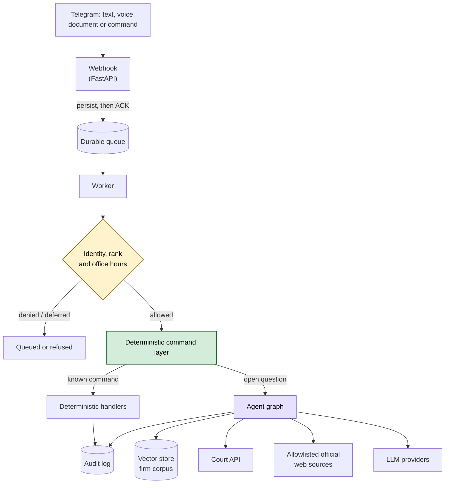
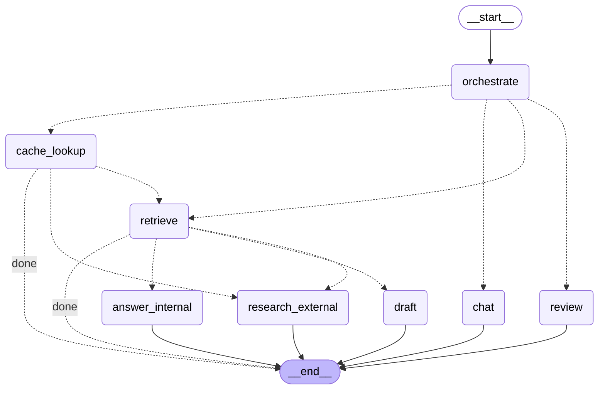

# Legal AI Assistant

A production Telegram assistant for a Brazilian law firm: it answers questions
against the firm's own document corpus, researches public legislation and case
law, follows lawsuits through the national court API, drafts and reviews text,
and delivers any answer as a Word, PDF or spreadsheet file — all inside the chat
app the lawyers already keep open.

This repository is a **showcase**. It documents the architecture and the
engineering decisions behind a system that runs in production. The
implementation is private; see [About the code](#about-the-code).

> **Context.** Built and operated for a law firm in Brazil. The client is not
> named here, and every operational detail — infrastructure, credentials,
> deployment, monitoring — is deliberately omitted. What follows is the design
> story, not a runbook.

---

## The problem

A small law firm's knowledge lives in two places that do not talk to each other:
thousands of documents nobody can search, and public sources — legislation,
case law, court dockets — that take a paralegal an afternoon to check by hand.

Most "AI for law" tools answer confidently from neither. That failure mode is
not acceptable here: an invented article of law or a hallucinated deadline is a
professional liability, not a bad user experience. The whole design follows from
that single constraint.

## What it does

**Ask in plain Portuguese, by text or voice.** Audio is transcribed before
routing, seeded with legal vocabulary so "agravo de instrumento" does not arrive
as "agravo de estrumento". The transcript is shown back before anything acts on
it.

**Answer from the firm's corpus.** Documents arrive by chat attachment — PDF,
DOCX, TXT, Markdown or images. Digital PDFs are parsed; scanned pages and
photographs go through Portuguese OCR. Text is embedded into a vector store and
becomes searchable immediately.

**Search a corpus too large to list.** Filters are read deterministically from
the message before any model call — kind of document, client or matter, and a
window in time — so the catalogue keeps working when a model provider is down.
The same filters work in prose or as a command.

**Research public sources, and actually read them.** Web search is restricted to
an allowlist of official domains, re-checked on every redirect. The pages that
come back are opened and extracted, not quoted from a search snippet.

**Follow a lawsuit.** A docket number is recognised anywhere in a message,
routed to the public court API, and answered with the case class, court, subject
and latest movements — plus a link to the court's own system, with the number
formatted to paste into the form.

**Draft, review, and export.** Answers become Word documents, PDFs or
spreadsheets. Structure survives the conversion: a heading becomes a real Word
heading, a table becomes real spreadsheet columns. Every exported file carries
its sources and the notice that the final opinion belongs to the responsible
lawyer.

**Compute procedural deadlines.** Business-day counting under the Brazilian
Code of Civil Procedure, including the year-end recess and the rule that
excludes the starting day and includes the due date.

---

## Architecture

The shape that matters: **authorization and command routing sit before the agent
graph, not inside it.** The model is reached only after a deterministic layer has
decided who is asking, what rank they hold, and whether the request is a known
command. A model that misbehaves cannot widen its own permissions, because it was
never the thing holding them.

### The agent graph

The routing graph itself, generated from the running application:

An orchestrator classifies the request, then routes to one of several
specialists — internal research over the corpus, external research over public
sources, drafting, review, or plain conversation. Cache lookup happens on the
way in, and every path terminates explicitly.

---

## Engineering decisions

The decisions below are the reason the system is trustworthy enough to put in
front of lawyers. Each one is written up in
[docs/engineering-decisions.md](docs/engineering-decisions.md).

### The model proposes; deterministic code decides

Permissions, command names, identifier resolution, and every state transition
are validated outside the model. This is not a stylistic preference — it closed a
real defect. A rank check applied to the `/arquivo` command was bypassed simply
by asking for the same thing in Portuguese prose. The fix was to gate the
**action**, not the command string, so the typed form and the spoken form pass
through the same authorization.

### Authorization fails closed

Four ordered ranks, checked as "at least this rank" so inserting a rank in the
middle never silently widens what the ranks above could already do. A role value
that is missing, unknown or corrupted resolves to the **lowest** rank — a
damaged record must lose privilege, never gain it. Destructive actions are
authorized twice: once in the handler, and again inside the repository, so
neither layer is the only thing standing between a caller and the write.

### Persist before acknowledging

The webhook writes every update to a durable queue before returning `200`. The
worker drains it, retries on failure, and moves a poisoned message aside rather
than losing it or looping on it. A restart mid-conversation costs nothing.

### Every answer carries its evidence

An answer built on the corpus or on a public source states what it rests on and
can list each source with the excerpt, article, court and date behind it — never
a bare URL. Answers and their sources are cached as a **single record**, because
an earlier version cached them separately and a cache hit could serve a
conclusion whose evidence had gone missing.

### Cache identity is part of the contract

The cache key includes the task, the client, the model, a schema version, and a
fingerprint of the source policy. Two different questions that happen to share a
prompt cannot collide, and widening the allowlist invalidates exactly the
answers whose coverage changed. Anything asking for current information is not
served from cache at all.

### Business rules are pure libraries

Procedural deadline counting is a pure function with no I/O and no model in the
path. The legal regime is a required argument with no hidden default, because
guessing it produces a wrong deadline that looks exactly like a right one. Only
national holidays ship by default; local ones must be supplied explicitly rather
than invented.

### Commands ask for what they need

A bare command used to reply with a usage line — the one thing the person who
typed it already knows. Each now asks for the single missing detail and waits:
it lists the eligible options, parses the reply deterministically, and rewrites
it into the equivalent command. The model never resolves an identifier, so the
gate that guards the typed command guards the answered one too.

---

## Reliability

| | |
|---|---|
| Automated tests | 270, covering authorization, routing, caching, research, exports and business rules |
| Core implementation | ~9,000 lines across 51 modules |
| Test code | ~4,400 lines |
| CI gate | lint, static type checking, full test suite, container build, and a check that the architecture diagram matches the code |
| Configuration | validated at startup, before the database is opened — an incompatible provider/model pair refuses to boot instead of silently falling back |

That last row came from a real incident: the environment named one model while
the code silently substituted another on a failed lookup, so the firm believed
it was running a model it was not. Configuration is now checked at boot and the
mismatch is fatal.

## Tech stack

**Python 3.12** · **FastAPI** · **LangGraph** · **PostgreSQL + pgvector** ·
**Redis** · **OpenAI / Gemini** · **Tesseract OCR** · **Docker Compose** ·
**Prometheus + Grafana** · **GitHub Actions**

Documents: `pypdf`, `python-docx`, `openpyxl`, `reportlab`.
Quality: `pytest`, `ruff`, `pyright`.

---

## About the code

The implementation is private, and stays private: it was built for a client, it
handles privileged legal material, and its operational surface is not something
to publish.

**For interviewers and technical reviewers:** I can grant read access to the
private repository on request, or walk through any part of it live — the agent
graph, the authorization layer, the retrieval pipeline, or the test suite.

**For firms evaluating something similar:** the architecture above is
reproducible for another practice without reusing a line of the client's data or
configuration. Happy to talk through what it would take.

---

## Further reading

- [Architecture in depth](docs/architecture.md) — the request lifecycle, the
  retrieval pipeline, and where the trust boundaries sit.
- [Engineering decisions](docs/engineering-decisions.md) — the trade-offs above,
  written up with the failure each one prevents.
