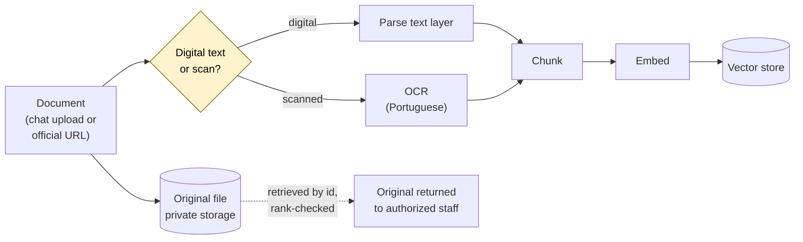

# Architecture in depth

This document describes how a message becomes an answer, where the trust
boundaries sit, and why the pipeline is shaped the way it is. Operational
details — infrastructure, deployment, monitoring, credentials — are out of
scope by design.

## The request lifecycle

A message travels through five stages, and the order is the point.

### 1. Accept and persist

The webhook does as little as possible: validate the request came from the
messaging platform, write the update to a durable queue, return `200`.

Returning `200` is a promise that the message will not be lost, so it is made
only after the write succeeds. Any work done before that acknowledgement is work
that can be lost in a crash, and a lawyer who sent a document at 18:55 has no
way to know it evaporated.

### 2. Identify and authorize

The worker resolves the sender to a staff record and a rank. An unknown account
gets a one-time request code and the managers are notified; it never reaches the
corpus.

Office hours are enforced here too. Outside them, most messages wait in the
deferred queue, but the account that operates the system is served immediately,
so the system can be worked on at night. The webhook makes this decision with a
single indexed lookup under a hard timeout, and defers on any doubt — the queue
holds the message either way, so the safe answer is always "later".

### 3. Route deterministically

Before any model runs, the message is checked against the known command surface
and the known intents. This layer resolves:

- explicit commands and their aliases;
- an unknown command — corrected against the real command list, or answered with
  the commands that person's rank may actually use;
- catalogue filters (kind, matter, date window) parsed straight from the text;
- an answer to a question the assistant is currently waiting on;
- follow-ups that refer to the previous answer ("and the sources?", "send it as
  a PDF").

Everything resolved here is resolved without a model. That is what keeps the
catalogue, the staff directory, the export flow and the command surface working
when a provider is down or slow.

### 4. Reason

What is left — an open legal question — enters the agent graph. An orchestrator
classifies it and routes to a specialist: internal research over the firm's
corpus, external research over public sources, drafting, review, or
conversation.

Retrieval and research are tools the graph may call. They are not permissions it
may grant itself: the rank check already happened in stage 2, and the corpus the
retriever can see was already bounded before the graph started.

### 5. Deliver

The reply states what it rests on and offers its sources. Long answers offer a
file. Exports carry the sources and the professional-responsibility notice into
the document itself, because a file outlives the chat window it came from.

## The retrieval pipeline

Two things are stored, and they are kept apart on purpose. The **text and its
embeddings** go to the vector store and are what search reads. The **original
file** goes to private storage addressed by a content hash, and is never served
by a public path — an authorized member retrieves it by id, through a
rank-checked command.

Ingestion is bounded: size and page limits are enforced before work begins,
because an unbounded OCR job is an availability problem wearing a feature's
clothing.

## Trust boundaries

There are three, and keeping them distinct is most of the security design.

**Between the internet and the system.** Only the webhook is exposed. Data
stores are not on a public network. Uploaded documents are never served from a
public path.

**Between a user and their rank.** Ranks are ordered and checked as "at least
this rank". Every privileged action is authorized in the handler and again in
the data layer. Authorization is attached to the action, never to the spelling
of a command — otherwise the same request phrased as prose walks around the
check, which is exactly the defect that motivated the rule.

**Between the model and the system.** The model reads and proposes. It does not
authorize, does not resolve identifiers into privileged operations, does not
name its own commands, and does not decide whether a document may be released.
Its output is treated as untrusted input to a deterministic layer.

## External sources

Public research is deliberately narrow:

- an **allowlist of official domains**, re-checked on every redirect hop, so a
  redirect cannot walk the fetcher off the list;
- **bounded** bytes, pages and time per fetch, with extraction off the event
  loop;
- **court dockets** go to the official court API, not to a web search — the API
  is the authoritative source for case movement, and mixing the two produces an
  answer that looks sourced but is not;
- a request that is purely a docket lookup makes **no web call at all**.

Every fact taken from outside is carried with its origin, so the answer can
always show where each claim came from.

## Observability

The system reports health as a **capability**, not a binary. Required
dependencies determine whether it is ready to serve at all; degraded external
research is reported separately, so losing a research provider is visible
without taking down the local corpus and the command surface. Health checks are
configuration-only — they never spend API quota to prove a key works.

Failure states worth paging on are the ones that are silent otherwise: a growing
dead-letter queue, disk pressure from ingestion, and a configuration that no
longer matches what the environment declares.
